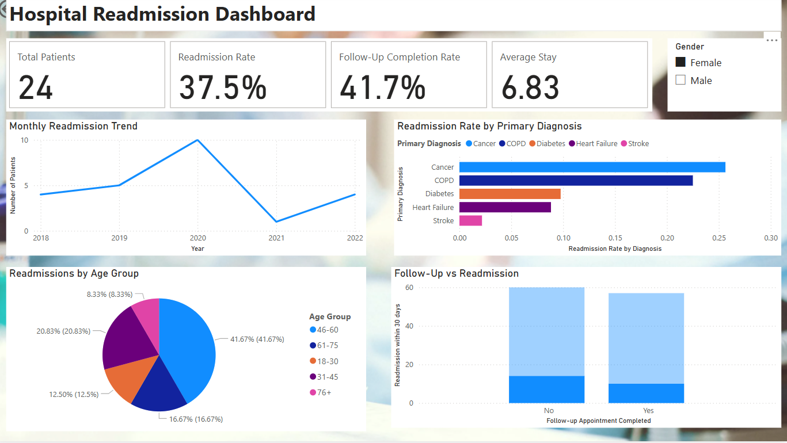

# Hospital Readmission Analysis Dashboard

## About the Project

Designed an interactive Power BI dashboard to analyze five years of hospital readmission data and uncover actionable insights to improve post-discharge care. Leveraging Power Query for data transformation and DAX for KPI calculations, the dashboard enables healthcare teams to monitor trends by diagnosis, demographic groups, and follow-up completion.

The dashboard supports decision-making by highlighting high-risk patient segments and evaluating the impact of follow-up interventions on readmission rates.

## Key Features:

* KPI Summary Section highlighting:

Total Patients

Readmission Rate (%)

Average Length of Stay (days)

Follow-Up Completion Rate (%)

* Readmission Rate by Diagnosis using a clustered bar chart to identify high-risk conditions (e.g., Heart Failure, COPD)

* Demographic Breakdown with stacked visuals showing readmissions by Age Group and Gender for targeted care insights

* Follow-Up vs Readmission Comparison with side-by-side bars, visually emphasizing the impact of missed follow-ups

* Monthly Trend Line displaying patient readmission patterns over time to assess seasonality or intervention outcomes

* Interactive Slicers for Gender

* Conditional Formatting & Tooltips for enhanced readability and drill-down capability

* Clean Data Model powered by Power Query and DAX measures for accurate and real-time filtering

## Data Cleaning

* Imported and transformed raw hospital readmission data using Power Query Editor

* Formatted data types (e.g., date, number, text) to ensure consistency across columns

* Created custom columns such as “Admission Month” using Power Query date functions

* Replaced numerical flags (0/1) with meaningful labels ("No"/"Yes") for better readability

* Removed null values and unnecessary columns to reduce noise in reporting

Built DAX measures for:

* Readmission Rate based on filtered “Yes” responses

* Follow-Up Completion Rate and Average Length of Stay

* Used DAX logic and ALLEXCEPT() to calculate diagnosis-specific rates

* Ensured data accuracy and dashboard responsiveness through calculated fields and slicers

## Power BI Visualization

I utilized Microsoft Power BI to create a visual representation of the data. 

### Snapshots

**DASHBOARD**

## Conclusion

* Patients with conditions like Heart Failure and COPD had the highest readmission rates

* Patients without follow-up appointments were significantly more likely to be readmitted

* Senior age groups (61–75, 76+) showed consistently higher readmission rates, suggesting a need for targeted follow-up strategies

* The readmission rate dropped in years where follow-up compliance improved

* Medicare patients showed higher readmission rates compared to privately insured patients

## How to Use

To view the visualization, follow these steps:
1. Download the Power BI workbook from the repository.
2. Open Power BI Desktop or Power BI Public.
3. Open the downloaded workbook to interact with the visualization.
